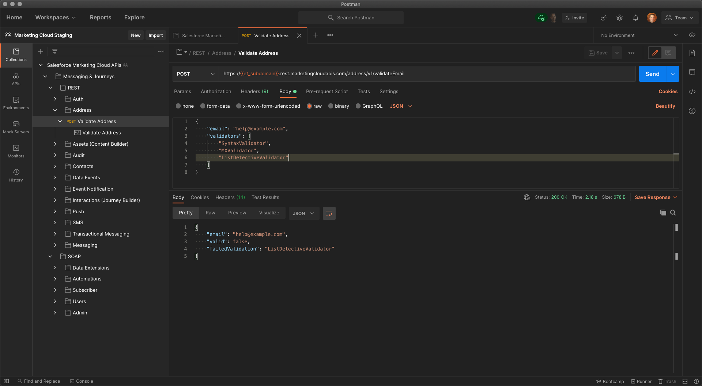
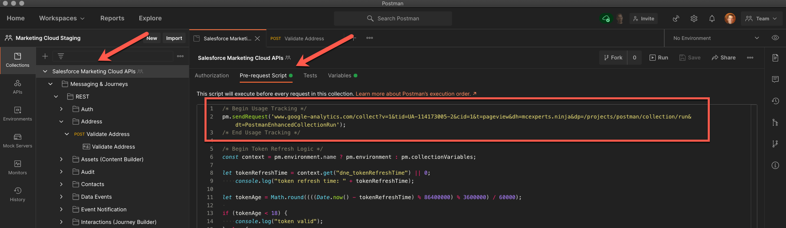

> ℹ️  **February 2021 update:** the collection sources were moved to a [Postman Public Workspace](https://www.postman.com/salesforce-developers). This makes it easier to install, update and contribute to the collection. 
This repository is now dedicated to hosting the setup/contribution documentation and tracking issues.

# Salesforce APIs for Postman

A [Postman](https://www.postman.com) collection of 170+ requests for the following Salesforce APIs:

REST
<table>
   <tr>
      <td>
         <ul>
            <li>Address</li>
            <li>Assets (Content Builder)</li>
            <li>Audit</li>
            <li>Contacts</li>
            <li>Data Events</li>
            <li>Event Notification</li>
         </ul>
      </td>
      <td>
         <ul>
            <li>Interactions (Journey Builder)</li>
            <li>Push</li>
            <li>SMS</li>
            <li>Transactional Messaging</li>
            <li>Messaging</li>
         </ul>
      </td>
   </tr>
</table>

SOAP
<table>
   <tr>
      <td>
         <ul>
            <li>Data Extensions</li>
            <li>Automations</li>
            <li>Subscriber</li>
            <li>Users</li>
            <li>Admin</li>
         </ul>
      </td>
   </tr>
</table>

**⚠️ Disclaimers:**
- This collection is provided as-is. It's not officially supported by Salesforce or covered by SLAs.
- API documentation is not provided with the collection. Please refer to the [official documentation](https://developer.salesforce.com/docs/atlas.en-us.mc-apis.meta/mc-apis/index-api.htm).
- To help us better understand usage of the collection, we leverage Google Analytics. If you would like to opt out of the tracking, you can remove the Pre-request Script set at the collection level.
	- 

## Issues and Questions

Report issues and ask questions [here](https://github.com/salesforce-marketingcloud/postman/issues).

## Installation

You can use the **Postman desktop app** or the **Postman web UI** to connect to Salesforce with the Salesforce APIs collection:

- [Install using the Postman desktop app](install-with-app.md)
- [Install using the Postman web UI](install-with-web.md)

Regardless of whether you choose the desktop app or the web UI, you can use all of the collection’s requests and your changes are synchronized between the two environments so you can easily switch between them at any time.

## Additional Documentation

- [Keeping the collection up to date](updating.md)
- [Working with environments to connect to multiple orgs](working-with-environments.md)
- [Contributing](contributing.md)