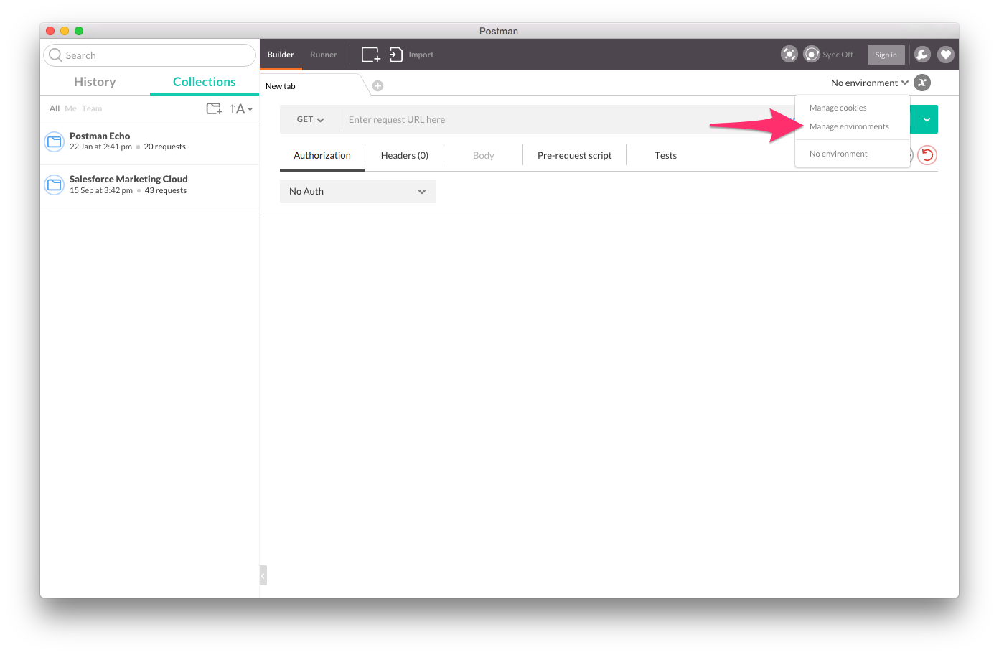
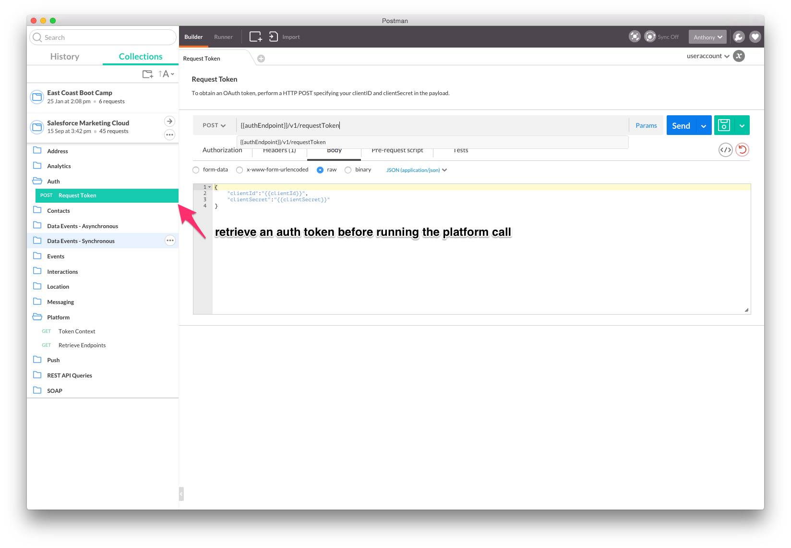
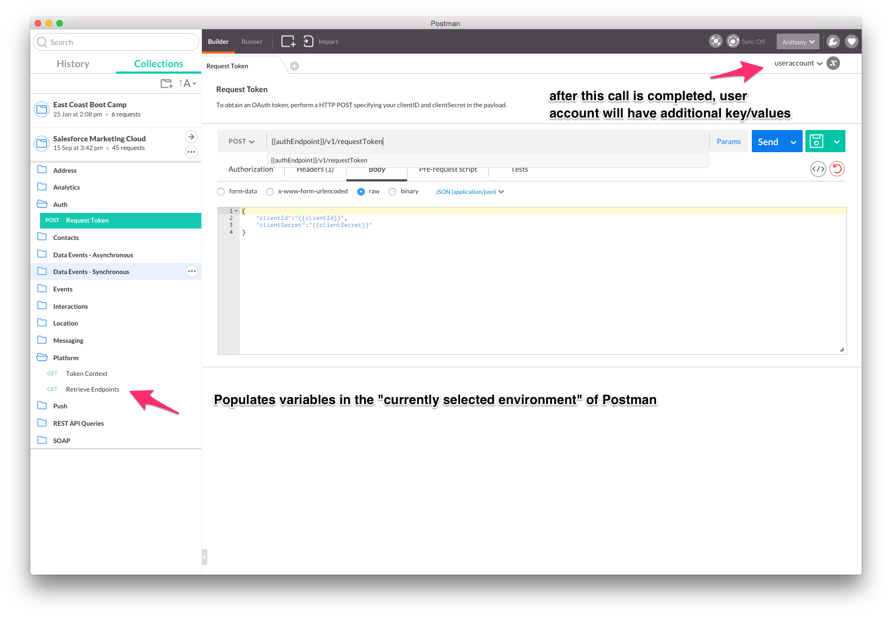

# sfmc-postman
SFMC = Salesforce Marketing Cloud

The files in this repository are to be leveraged with the Google Chrome application Postman. Postman can be installed from here: [http://www.getpostman.com/](http://www.getpostman.com)

Below are the current file descriptions.

- **SFMC.json.postman_collection**: This file needs to be imported into Postman. It hosts the actual REST and SOAP calls to the SFMC API.
- **useraccount.postman_environment**: This file needs to be imported into Postman. It contains environment variables specific to each individual SFMC account you want to access. You can clone to setup multiple SFMC accounts as needed.

### REST API Requirements
To run the REST API calls you will need to fill out at least the clientID and clientSecret variables within the userAccount environment. 

> * You must call the Auth/RequestToken REST API to get a 60 minute accessToken before making subsequent calls.

### SOAP API Requirements
You will need to fill out the soapEndPoint variable plus at least one of the following sets of variables:

- For Username/Password (WS-Security) calls soapUsername and soapPassword.
- For Token (OAuth) calls clientID and clientSecret.

> * You must call the Auth/RequestToken REST API to get a 60 minute accessToken before making subsequent token based SOAP API calls.

### Social API Requirements
To leverage the Social API you will need to have created an API key in Social Studio. Information on creating an API key can be found here: [Enable API for Applications](https://developer.salesforce.com/docs/atlas.en-us.api_social.meta/api_social/1-enable-api-applications-for-tenant.htm)

For variables you will need to set:
* <b>socialClientKey</b> - created when you create the API application
* <b>socialClientSecret</b> - created when you create the API application
* <b>r6Username</b> - your Social Studio username
* <b>r6Password</b> - your Social Studio password

After you have completed this, please re-run SFMC - Platform "Retrieve Endpoints", this will setup a needed Social Studio variable and verify you have all of the needed SFMC variables set.

Note: when you call Get Social API Token, your Social API Token will automatically be set into the environment: access_token

### Importing into Postman
You'll want to import this collection and environment variables into your instance of Postman.

To import the Collection:

Once this is completed, you will have a new collection inside your Postman instance. 

To import an environment*:

* Recommendation is to edit this file *first* with your favorite editor. Don't worry about filling out every single value in the file, the import values to complete are for the keys (clientId, clientSecret)

Once you have completed both imports, you are ready to finish setting up the envrionment. In this last step, Postman will setup the rest of the needed environment variables.

First run the authentication call:

Second, run the Platform/Retrieve Endpoints call to inject the SOAP & Rest variables into you current environment.

### Additional Resources
- CODE@ App Center for creating clientId and clientSecret per SFMC business unit is here: [https://appcenter-auth.exacttargetapps.com/]()
- SOAP API end point information here: [http://help.exacttarget.com/en/technical_library/web_service_guide/working_with_soap_web_service_api/]()
- SOAP API code samples here: [http://help.exacttarget.com/en/technical_library/web_service_guide/technical_articles/]()
