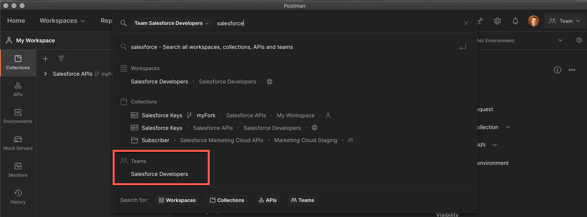
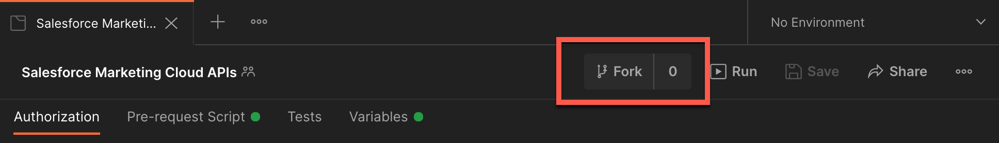
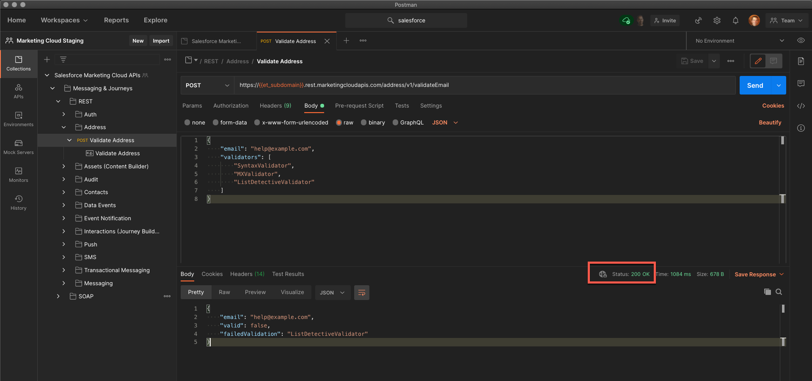

[Back to main page](README.md)

> Instructions designed for use in the Web app or Postman's desktop app v8.

# Installing the Collection

- [Choose Your User Interface (Desktop or Web)](#choose-your-interface)
- [Install the Postman App](#install-the-postman-app)
- [Create an Installed Package in Marketing Cloud](#create-an-installed-package-in-marketing-cloud)
- [Fork the Collection](#fork-the-collection)
- [Configure the Collection](#configure-the-collection)
- [Execute a Request](#execute-a-request)

## Choose Your Interface (Desktop or Web)

### Postman App

Download and install the Postman app from [this link](https://www.postman.com/downloads).

### Web App
Using a browser, [sign up/in to Postman](https://identity.getpostman.com/login).

## Create an Installed Package in Marketing Cloud

1. Go to Marketing Cloud -> Apps -> Installed Packages
2. [Create an installed package](https://developer.salesforce.com/docs/atlas.en-us.mc-app-development.meta/mc-app-development/install-packages.htm) with enhanced functionality, or navigate to an existing package created with enhanced functionality.
3. Under Components, click Add Component.
4. Select API Integration.
5. Select Server-to-Server integration type.
6. Define the scope properties for the integration the properties for the integration
7. Save the component.

>Make note of the Client Id, Client Secret, and Authentication Base URI. Additionally if you don't already have it get the MID for the Business Unit. **You must use the Enhanced functionality. This package will not work with legacy integration packages.**

## Fork the Collection

1. In the Postman desktop app, click on the top search bar and type **Salesforce**
2. Click **Salesforce Developers** under Teams

    

3. Click the **Salesforce Markting Cloud APIs** tile
4. Click **Fork**

    

5. Enter a label for your fork (e.g.: “My fork”)
6. Select a workspace (the default “My Workspace” workspace is fine)
7. Click **Fork Collection**

## Configure the Collection

The collection uses a series of collection variables to help streamline your calls. To successfully use the package it's important to be sure to update the collection variables.

1. Click **Salesforce Marketing Cloud APIs**
2. Open the **Variables** tab
3. Complete the following variables for your instance. Instructions for collecting these details can be found in the [Create an Installed Package in Marketing Cloud](#create-an-installed-package-in-marketing-cloud) section

|Variable|Example Value|Description|
|-|-|-|
|et_subdomain|28yte38jw4un5gkoky2w6|Tenant specific subdomain Authentication Base URI value. **Only include the subdomain.**|
|et_clientId|kx2xo6o2updxf2anwquyg|Client Id|
|et_clientSecret|gj38398t7g89nbqn58gtp|Client Secret|
|et_mid|14618743|MID of business unit|

4. Click **Save**.

## Collection Authentication

The collection has been configured to automatically request an access token based on if a token is present or expired. This is accomplished by using the collection variables defined in the [Configure the Collection](#configure-the-collection) section combined with a pre-request script. 

The script creates two new collection level variables:
* dne_tokenRefreshTime 
* dne_etAccessToken 

The Marketing Cloud authorization tokens are valid for 20 minutes therefore when a token is requested we create a new variable called **dne_tokenRefreshTime** that stores the time the token was generated. Each subsequent call will use this refresh time to determine if a new token should be requested.

The token returned in the authorization call is stored as the collection variable **dne_etAccessToken**. For REST calls, this token is passed in the authorization header defined by a pre-request script at the REST folder level. For SOAP calls the token is passed in the body of the SOAP envelope.

## Execute a Request

1. Expand the collection and select the `Messaging & Journeys -> REST -> Address -> Validate Address` request.
1. Click `Send`.

At this point, if your environment is correctly set up, you should see a `200 OK` status. This means that you have successfully authenticated with Salesforce Marketing Cloud and that you can now use the other collection’s requests.

See [additional documentation](README.md#additional-documentation) for more information on how to keep the collection up to date and work with multiple Salesforce orgs.

[Back to main page](README.md)