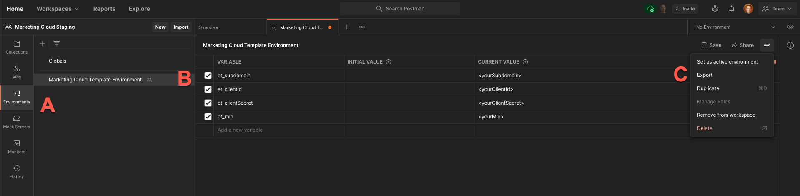
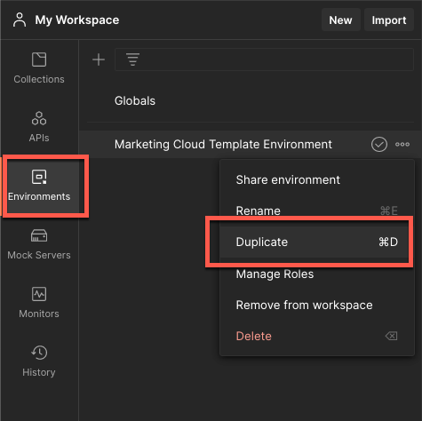
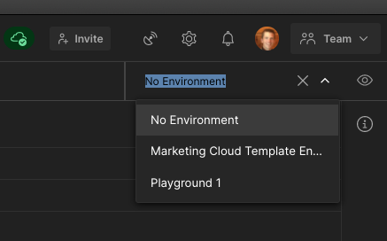

[Back to main page](README.md)

# Working With Environments To Connect To multiple Marketing Cloud Instances

While the variables are stored by default in the collection you can use Postman with [environments](#https://learning.postman.com/docs/sending-requests/managing-environments/) to work with multiple Marketing Cloud instances in parallel.

The pre-request script has been written to determine if an environment has been selected. If it has been, the environment variables will be used for the authorization. For the request level variables, by default in Postman the environment variables will supersede the collection level variables. 

> ⚠️ Using environments means that you will store Marketing Cloud credentials in clear in Postman. Do this at your own risks.

- [Import the Template Environment](#import-the-template-environment)
- [Configure the Environment](#configure-the-environment)
- [Change the Collection Authorization Type](#change-the-collection-authorization-type)
- [Authenticate with Salesforce](#authenticate-with-salesforce)

## Import the Template Environment

1. Using a browser, [sign up/in to Postman](https://identity.getpostman.com/login).
2. Open the main collection with [this link](https://www.postman.com/salesforce-developers/workspace/salesforce-developers).
3. Select the **Environments** tab (item A in following screenshot)
4. Click **Salesforce Environment Template** (B)
5. Click on the “three dots” icon on the right (C) and select **Export** from the menu.

    

    This downloads a `Marketing Cloud Template Environment.postman_environment.json` file.

6. Close the browser tab. We'll continue the installation on the Postman app.
7. In the Postman app, click **Import**.
8. Drag and drop the JSON file you just downloaded in the gray zone.
9. Click **Import**.

## Configure the Environment

1. Click on the Environments icon
2. Click on the “three dots” icon on the right of the environment template and select duplicate

	

    This creates a `Marketing Cloud Template Environment Copy` template.

1. Click **Marketing Cloud Template Environment Copy**.
1. Rename the environment with something meaningful in relation with your Marketing Cloud instance (e.g.: “Playground 1”).
1. Set values in the **CURRENT VALUE** column for the following variables. If you need instructions for getting these variables go to: [Create an Installed Package in Marketing Cloud](install-the-collection.md)

|Variable|Example Value|Description|
|-|-|-|
|et_subdomain|28yte38jw4un5gkoky2w6|Tenant specific subdomain Authentication Base URI value. **Only include the subdomain.**|
|et_clientId|kx2xo6o2updxf2anwquyg|Client Id|
|et_clientSecret|gj38398t7g89nbqn58gtp|Client Secret|
|et_mid|14618743|MID of business unit|

1. Click **Update** and close the environments dialog.
1. Select your environment from the environment dropdown.

    

[Back to main page](README.md)